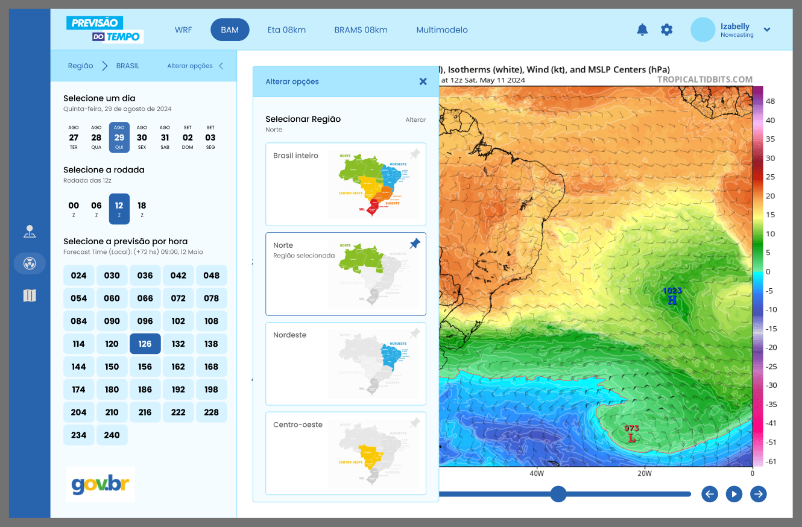
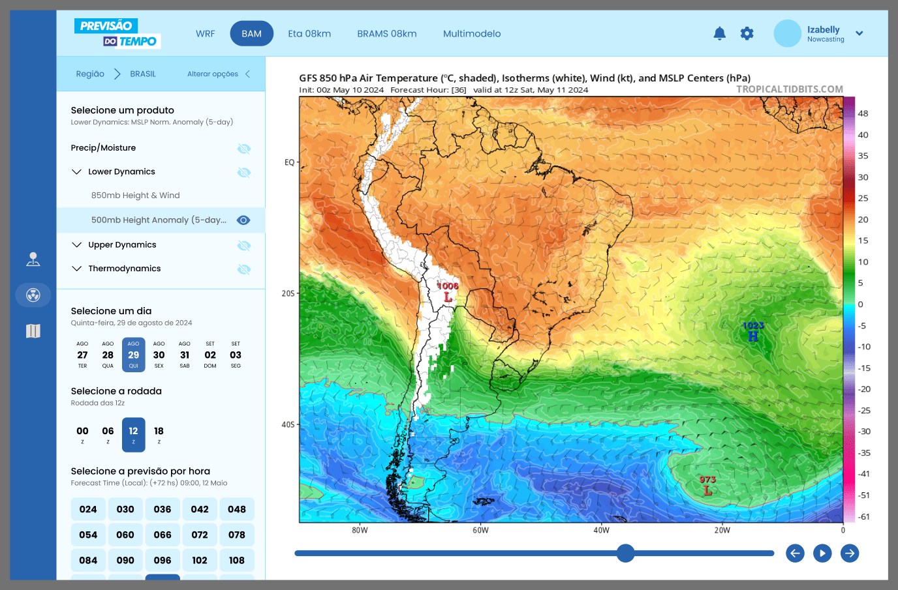

# Página de Previsão Numérica de Tempo

Nesta página será possível selecionar o modelo, o dia, a rodada e a hora para obter a imagem de previsão do tempo. Também será possível selecionar a região desejada.

## Instalação

O projeto tem as seguintes dependências:

```bash
> npm install -D nodemon
> npm install express
> npm install ejs
```

Configurar o Tailwind e depois o arquivo _./tailwind.config.js_:

```bash
> npm install -D tailwindcss
> npx tailwindcss init
```

Foi baixado para ser utilizado neste projeto as seguintes bibliotecas:

- [FontAwesome](https://fontawesome.com/icons) (Ícones)
- [Poppins](https://fonts.google.com/specimen/Poppins) (Google Fonts)
- [HTMX](https://htmx.org/)

Uma pré-visualização da página seria esta:



